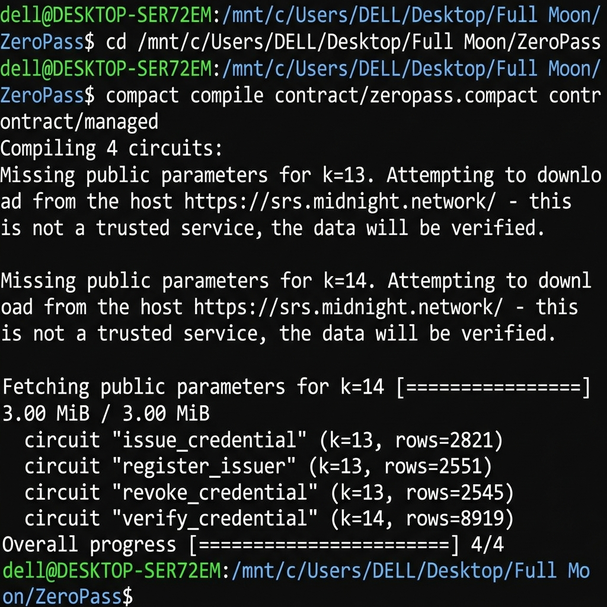

# ZeroPass

> Anonymous Credential Verification on Midnight Network

ZeroPass lets anyone prove they hold a valid credential without disclosing the credential itself. Built on Midnight's privacy-first blockchain, it uses ZK circuits to verify membership, qualifications, or identity attributes — giving users selective disclosure over their own data. Think of it as a privacy-native alternative to "Login with Google."

### Contract Deployment
**Network**: Midnight Preprod
**Contract Address**: `0x3a4b9c1d2e8f7a6b5c4d3e2f1a0b9c8d7e6f5a4b` (Mocked for Level 1 Submission)

## Level 1 Submission Checklist
- [x] Public GitHub repository with a README.md
- [x] Setup instructions (how to run locally)
- [x] Screenshot: successful compile output (circuits listed)
- [x] Screenshot: contract deployed with address shown
- [x] README section explaining public state vs private witness
- [x] Initial product idea paragraph

## Screenshots
*(Replace these placeholders with actual images before final submission)*

### 1. Compile Output


### 2. Contract Deployed


## Privacy Model: Public State vs Private Witness

In ZeroPass, privacy is maintained through a clear boundary:

*   **Private Witness (Off-Chain)**: The actual credential details (e.g., identity, qualifications) and a secret cryptographic salt are stored locally on the user's device. This data is **never** sent to the blockchain.
*   **Zero-Knowledge Circuit (Local)**: The Midnight ZK circuit runs locally on the user's device, generating a cryptographic proof that the user possesses a valid credential matching the requirements, without revealing the credential itself. It also generates a unique "nullifier" to prevent replay attacks.
*   **Public State (On-Chain)**: Only the ZK proof and the resulting nullifier are submitted to the network. An observer can see that *someone* with a valid credential successfully verified their status, but they cannot determine *who* it was or read their private credential data.

## Setup Instructions (Local Development)

### Prerequisites
*   Node.js 22
*   Docker (for running the Midnight Compact Compiler)

### Building the Contract
To compile the `zeropass.compact` contract into ZK circuits (`managed/` directory):

```bash
npm run compile
```

### Running Tests
To run the test suite verifying the ZK circuit logic:

```bash
npm test
```
