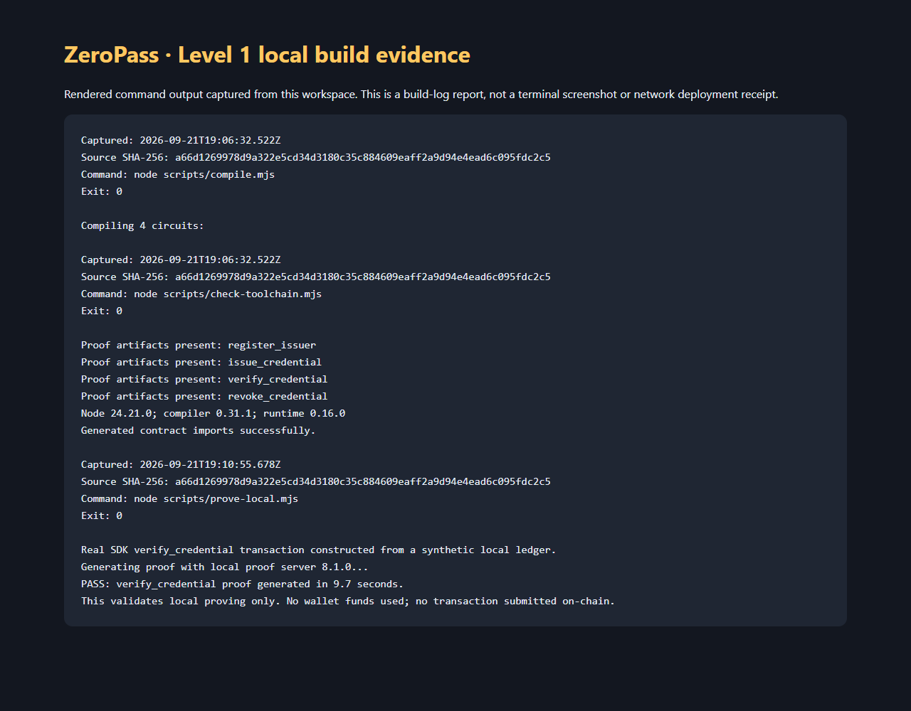

# ZeroPass

Credential verification on Midnight using private secret possession.

ZeroPass is a prototype for issuing and verifying credentials without publishing
their secret preimages. A trusted issuer registers a credential commitment; its
holder proves possession while the contract checks its type and revocation state.
The product idea is reusable membership or qualification verification with less
disclosure than handing each service a copy of the underlying document.

**Current status:** the Level 1 contract is deployed on **Preprod**, finalized at
block **2,673,631** on September 23, 2026. Its public receipt and all four circuit
verifier keys have been checked against the chain. Level 2 contains real Midnight
wallet, encrypted credential and circuit-submission code; the browser wallet
demonstration and public frontend release remain pending.

## Level 1 — Contract foundation

### Readiness

| Requirement | Evidence / status |
| --- | --- |
| Own Compact contract | [contract/zeropass.compact](contract/zeropass.compact) |
| Successful compilation | Pinned compiler 0.31.1; four circuits and generated proof assets; [current output](docs/compile-current.txt) |
| At least three meaningful passing tests | 31 tests; `npm run validate` |
| Public/private state explanation | Table below and inline contract comments |
| Product idea and reproducible setup | This README and linked guides |
| Meaningful Git history | Five focused repair commits, following the original project history |
| Actual Preview or Preprod deployment | **Confirmed on Preprod**, block 2,673,631; [receipt](deployments/preprod.json) and [on-chain verification](deployments/preprod.verification.json) |

See [the gap analysis](docs/LEVEL1_REVIEW.md) for the original problems, fixes and
remaining work. Current command evidence is documented in [TESTING.md](docs/TESTING.md).
The image below renders captured command output with exit codes and the source
hash; it is a build-log report, not a terminal screenshot or deployment receipt.
The older `docs/compile_output.png` remains historical compiler 0.34 evidence.



### Contract behavior

| Circuit | Authorization and effect |
| --- | --- |
| `register_issuer(issuer_id)` | Admin secret must hash to the constructor's admin ID; registers an issuer |
| `issue_credential(commitment, cred_type)` | Registered issuer only; rejects duplicate commitments; records owner/type |
| `verify_credential(expected_type, scope)` | Checks secret/salt commitment, issued type and revocation; records a scoped nullifier |
| `revoke_credential(commitment)` | Only the recorded issuing institution can revoke |

The holder computes `credential_commitment(secret, salt, ctype)` using the
generated pure helper. Admin and issuer IDs use `identity(secret)`. The same
holder secret and type can verify once per scope, allowing subsequent sessions
with different scopes. A verifier must generate and validate its session scope
and bind the resulting transaction to that session. The contract alone is not
a complete login protocol.

### Privacy: what is actually public

| Data | Visibility |
| --- | --- |
| Holder secret and salt | Private witness preimages |
| Admin and issuer secrets | Private authorization preimages |
| Credential type | Supplied as a witness, but also stored and checked publicly; not confidential |
| Credential commitment, existence and revocation | Public ledger and verification lookups |
| Credential issuer, issuer registry and admin ID | Public identifiers; secret preimages remain private |
| Issuance/verification counters | Public |
| Used nullifiers and their verification scopes | Public |

Verification discloses the credential commitment, linking activity to its recorded
issuer and type. ZeroPass does **not** currently provide anonymous membership,
hidden issuers or unlinkable presentations. Possession of a secret is not proof
of a person's real-world identity; credential sharing is not prevented.

Witness material is sent to the proving process. The scripts require a loopback
proof server so that this stays on the local machine. Only public transaction
data and the resulting proof are intended for the chain. The transcript regression
test checks for raw preimage leakage; it is not an independent security audit.

### Run locally

Prerequisites: Node.js 22+, the Compact CLI, and Linux/macOS or Ubuntu WSL on
Windows. Docker is needed for proving/deployment, not for the offline test suite.
Follow Midnight's [developer documentation](https://docs.midnight.network/)
to install the CLI, then install the compiler used by this repository:

```sh
git clone https://github.com/Mrinmoy-programmer07/ZeroPass.git
cd ZeroPass
npm ci
compact update --no-set-default 0.31.1
npm run compile
npm run validate
```

On Windows, run `compact update` inside Ubuntu WSL. The compile script invokes
that compiler through WSL automatically; the other commands run with Windows
Node. PowerShell users can use `npm.cmd` if script execution policy blocks `npm`.
See [VERSIONS.md](docs/VERSIONS.md) for the pinned compatibility matrix.

To generate a real proof with public test fixtures, start Docker and run these
in separate terminals:

```sh
npm run proof-server
```

```sh
npm run prove:local
```

This proves `verify_credential` locally without submitting a transaction. See
[TESTING.md](docs/TESTING.md) for what each verification layer establishes.

### Deploy to Preview or Preprod

Follow [DEPLOYMENT.md](docs/DEPLOYMENT.md) to configure a private SDK wallet,
fund it with test tNIGHT, register DUST generation, and deploy. The script uses
the actual generated contract and saves only finalized public evidence to
`deployments/<network>.json`. No placeholder address is a deployment.

| Network | Confirmed address |
| --- | --- |
| Preprod | `08e743143310064fa1f046077ff7057d78d6d2775265a2d7c789eef27a64d07a` |
| Preview | Pending |

Preprod transaction hash:
`513d5894017031af71422f8f4352695067e6cd1e38e0b4d827a8723e889668f3`.
Look up the address or transaction in the [Preprod explorer](https://preprod.midnightexplorer.com/).
The [deployment receipt](deployments/preprod.json) records the submitted intent ID;
the [verification receipt](deployments/preprod.verification.json) also records the
deployment intent ID, transaction hash and block hash. Re-check the public evidence
with `npm run deploy:verify`; this does not submit a transaction.

## Level 2 — Frontend integration

### What this does

The React interface connects to a compatible Midnight wallet, creates a holder
credential inside an encrypted browser vault, exports a public issuance request,
and prepares real calls to all four circuits. The administrator registers issuers;
issuers issue or revoke commitments; holders prove possession of active credentials.
The UI uses the actual SDK and compiled artifacts, with no simulation fallback.

### Readiness

| Requirement | Status |
| --- | --- |
| Wallet connect/disconnect and address display | Implemented with Midnight connector API 4; isolated connector/UI tests |
| Missing wallet, rejected request and wrong network | Handled and tested |
| Frontend regression suite | 19 passing tests in addition to Level 1's 31 tests |
| Circuit building, local proving, wallet approval and submission | Implemented with the real SDK; real-wallet network run pending |
| Private holder inputs kept off-screen | Randomly generated; encrypted at rest; only public request fields displayed |
| Transaction result and loading states | Explicit build/prove/approval/submit/pending/finalized/failed/unknown states |
| Privacy claim | Documented below; commitments and metadata remain public |
| Deployed contract address | Confirmed Preprod address above; included in `frontend/.env.example` |
| Live Level 2 URL and demo video | Pending frontend publication and a real-wallet recording |

### Privacy claim

An on-chain observer can see the credential commitment, its issuer/type/revocation
status, verification scope and nullifier. The holder proves knowledge of the
secret and salt behind a registered, non-revoked credential without publishing
those preimages to the chain. Repeated activity remains linkable by commitment.

Browser storage contains AES-256-GCM ciphertext derived from a 16+ character
passphrase using PBKDF2-SHA-256 (600,000 iterations). Backups are bound to the
wallet address, network and contract. Unlocked inputs exist in browser memory;
the local proof server receives witness material. This is not protection against
malicious extensions, compromised frontend code or a compromised device.

### Tech stack and prerequisites

React 19, Vite 8, Compact 0.31.1/runtime 0.16.0, Midnight.js 4.1.1, Midnight
connector API 4.0.1 and local proof server 8.1.0. Use Node 22.18+ (24 recommended),
a modern browser supporting WASM/top-level await, and a compatible Midnight wallet
such as Midnight Lace configured for Preview or Preprod. Cardano's wallet API is
not interchangeable with Midnight's connector.

### Run locally

```sh
# From the repository root, after the Level 1 setup above:
npm --prefix frontend ci
npm --prefix frontend test
npm --prefix frontend run dev
```

Start the local proof server in a separate terminal with `npm run proof-server`.
Enter a confirmed deployed contract address in the UI, or copy
`frontend/.env.example` to `frontend/.env.local` and set its **public** build values.
Never put wallet seeds, holder secrets, salts or admin/issuer secrets in `VITE_*`.

1. Find and connect your Midnight wallet on the correct test network.
2. Create a credential with a strong vault passphrase; export its encrypted backup.
3. Send the public issuance request to a registered issuer. The institution tools
   support issuer ID derivation, administrator registration, issuance and revocation.
4. Refresh public state to confirm issuance, then provide the verifier's scope
   and choose **Prove and submit**. A generated test scope is not a login session.
5. Approve the wallet request and wait for successful network finalization. If
   status is unknown, use **Check network status** instead of resubmitting.

See [LEVEL2.md](docs/LEVEL2.md) for deployment, recovery, limitations and the demo
recording checklist. See [LEVEL2_VERIFICATION.md](docs/LEVEL2_VERIFICATION.md) for
what was tested and what still needs a funded wallet.

### Live demo and demo video

The Level 2 release is not yet deployed or verified at a public URL. The historical
`zero-pass-zvhh.vercel.app` deployment and [legacy video](docs/demo_video.mp4) are
not evidence of this implementation or a successful on-chain call.

The repository includes [vercel.json](vercel.json). Set the Vercel project's Root
Directory to the **repository root**, then run these commands from that root:

```sh
npx vercel login
npx vercel link
npx vercel deploy
# After verifying the preview against the funded test-network contract:
npx vercel deploy --prod
```

Publish the confirmed URL/address and record the real-wallet flow before marking
Level 2 complete. The existing Git history already exceeds eight meaningful commits.

### Repository map

- `contract/zeropass.compact`: source of the four transaction circuits and hash helpers.
- `contract/managed/`: compiler-generated JavaScript, type definitions and proof assets.
- `contract/witnesses.mjs`: validated local witness accessors.
- `tests/`: actual generated-circuit regressions and offline deployment integration.
- `scripts/`: pinned compilation, wallet, proof and deployment commands.
- `frontend/src/components/`: wallet, credential vault, circuit and institution UI.
- `frontend/src/hooks/useMidnight.ts`: connected session and transaction tracking.
- `frontend/src/lib/`: real contract SDK, wallet connector, encryption and lifecycle.
- `frontend/tests/`: privacy, connector and transaction regressions.
- `docs/`: review, version, testing and deployment guidance.
