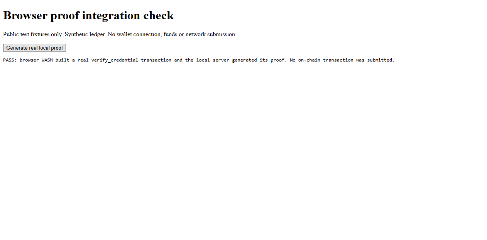
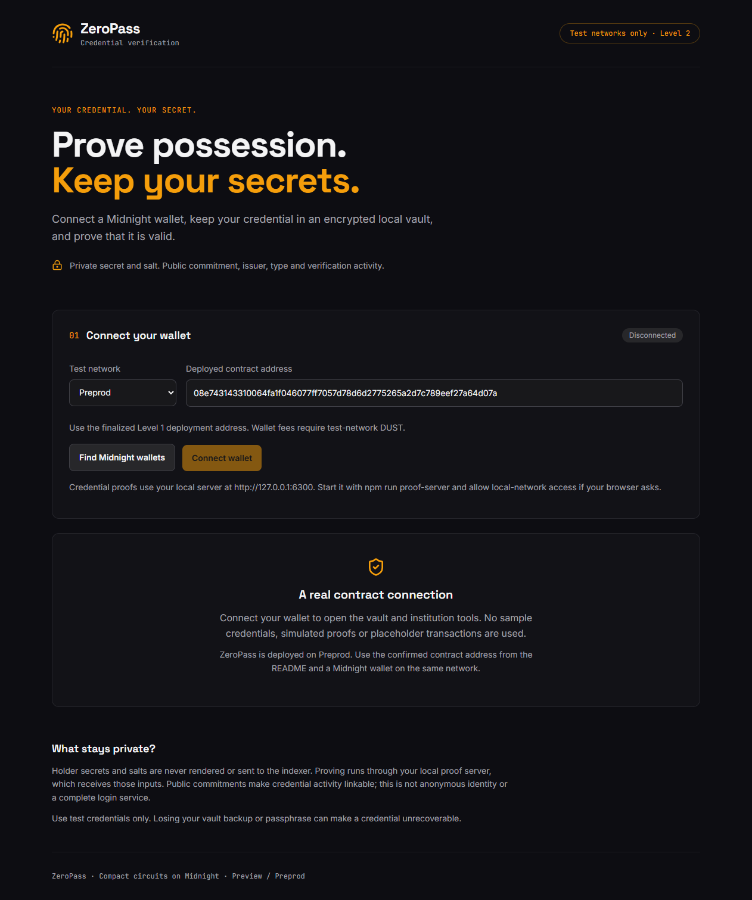

# Level 2 verification

Updated on 2026-09-24. Implemented code, test doubles, actual browser execution,
user-reported wallet behavior and confirmed chain evidence are distinguished below.

## Current release evidence (September 24)

| Boundary | Result |
| --- | --- |
| Frontend checks | 22 tests, lint and TypeScript/Vite production build pass |
| Contract/deployment checks | 31 root tests pass after the ws 8.21.3 update |
| Production dependency audits | Root and frontend each report zero vulnerabilities with `--omit=dev` |
| Real browser local proof | PASS: browser WASM builds `verify_credential`; proof server 8.1.0 generates the proof |
| Public frontend | https://zero-pass-zvhh.vercel.app renders the current interface and prefilled Preprod address |
| Hosted proof assets | All 12 prover/verifier/ZKIR files match `contract/managed/` byte-for-byte |
| Real Lace connection | User reports successful connection in Brave and supplies public issuance requests from the vault |
| Credential setup | Real SDK-wallet issuer registration and issuance finalized on Preprod; receipts linked below |
| Hosted local-network access | Automated browser permission is `denied`; user-browser access still needs verification |
| Holder verification and demo | Pending successful real-wallet transaction and a new recording |

The browser run found an SDK integration failure: its fetch provider invoked an
unbound native `fetch` as an object method, producing `Illegal invocation`. The
application and proof harness now supply `globalThis.fetch.bind(globalThis)`.
The real browser proof passed after that fix. Lace also supplied a remote prover
URL; ZeroPass now explicitly uses the local server for holder proofs, independently
of the wallet's own prover preference. No remote proving fallback was introduced.
The connection panel also checks the local prover's version without sending
credential inputs. Blocked requests show per-site permission guidance instead
of an opaque SDK error. Three additional tests cover this preflight behavior.

Public receipts:

- [First credential and issuer setup](../deployments/preprod.level2-setup.json):
  registration block 2,692,003 and issuance block 2,692,007.
- [Current Brave credential issuance](../deployments/preprod.level2-setup-5571ad3b.json):
  issuance block 2,692,108. A different local vault produced this second commitment.

These setup transactions used the configured SDK wallet, not Lace. Their success
does not establish that the holder's browser transaction has finalized.

## Earlier local UI checks (September 22)

| Layer | Evidence |
| --- | --- |
| Contract/deployment regressions | `npm run validate`: 25 passed |
| Frontend regressions | `npm --prefix frontend test`: 19 passed |
| Production build and lint | TypeScript, Vite and oxlint passed |
| Production dependency audit | `npm audit --omit=dev`: zero reported vulnerabilities at verification time |
| Browser SDK | Real Midnight SDK/WASM loaded after browser polyfill fixes |
| Address decoder | Long shielded addresses handled with checksum, network and payload validation |
| Production UI connection | Isolated connector test double opened the workspace; not a real Lace demonstration |
| Vault recovery | Production UI created, encrypted, locked and unlocked a randomly generated disposable credential |
| Privacy DOM check | Secret/salt absent from rendered text and input values; public commitment present |
| Encrypted storage | Secret/salt absent from stored ciphertext |
| Disconnect | Connected workspace removed and vault locked |
| Mobile layout | At 390px, document width did not exceed viewport; screenshot visually inspected |
| Browser errors | None reported during successful production UI/vault checks |

The 19 frontend tests cover encrypted round-trip, wrong password, tampering,
wallet/network/contract binding, malformed backups, public-only issuance export,
loopback proving, wallet discovery/duplicates, network mismatch, rejection,
successful finalization, proof failure, submission ambiguity, failed fallible
execution and timeout recovery without resubmission. Lifecycle tests use explicit
test doubles; they do not establish network finality.

## Additional browser proof harness

With the development server and local proof server running, open
`http://127.0.0.1:5173/tests/proof.html` and choose Generate real local proof.
The harness builds a real SDK transaction from a synthetic ledger and asks the
loopback server to prove it. It uses public fixtures only and cannot submit to a
network. It is not a production entry point.

The September 22 run could not complete because browser automation failed to
start. The subsequent real browser run passed, as recorded above. The separate
Level 1 Node proof remains documented in `proof-current.txt`. Neither synthetic
fixture proof submits an on-chain transaction.

## Not yet verified

- A real installed wallet approving fees and submitting a successful verification.
- Hosted-origin local-network permission and proof generation in Brave.
- A successful browser wallet circuit call on Preview or Preprod.
- A real-wallet demonstration video under two minutes.

Funding was initially deferred. On September 23, 2026, the SDK wallet was funded,
DUST was registered, and the Level 1 contract finalized on Preprod. Its public
[deployment receipt](../deployments/preprod.json) and
[verification receipt](../deployments/preprod.verification.json) are retained.
The wallet's `.env` and encrypted local state remain ignored; no secret was
published. Public frontend hosting is complete; its full browser-wallet
demonstration remains pending.

The production site lazily loads the SDK. Vite reports a large SDK chunk; the
ledger/runtime WASM assets total roughly 11 MB before compression. Expect a
heavier first connection than the initial page load.
